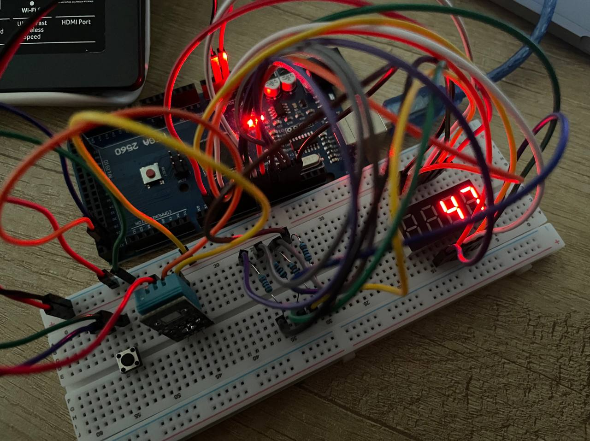
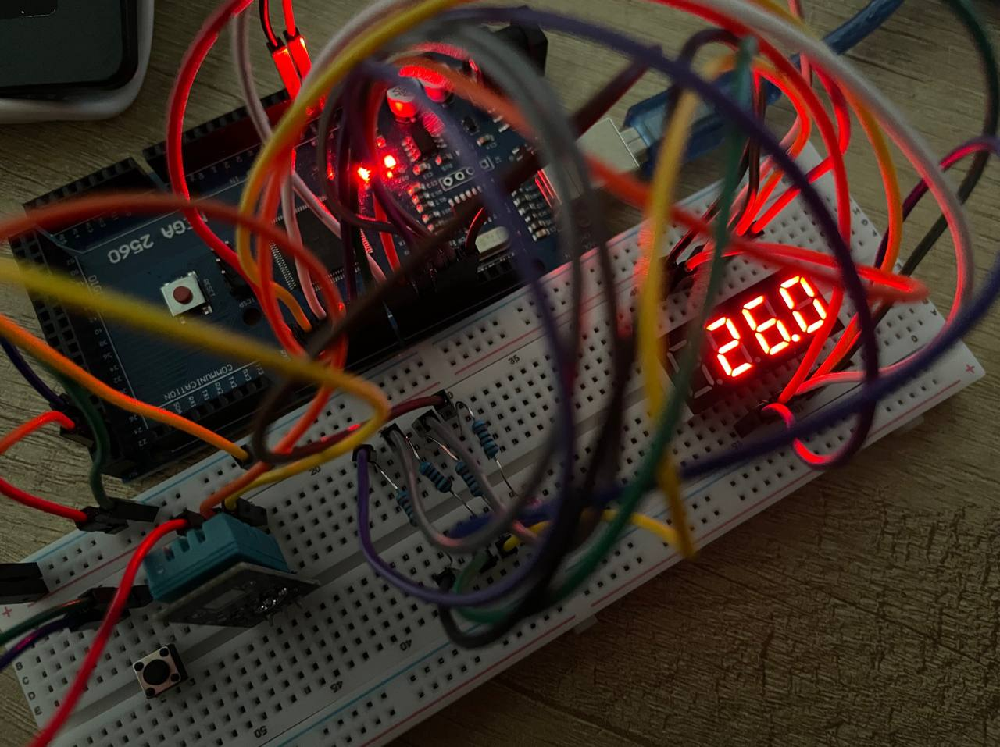
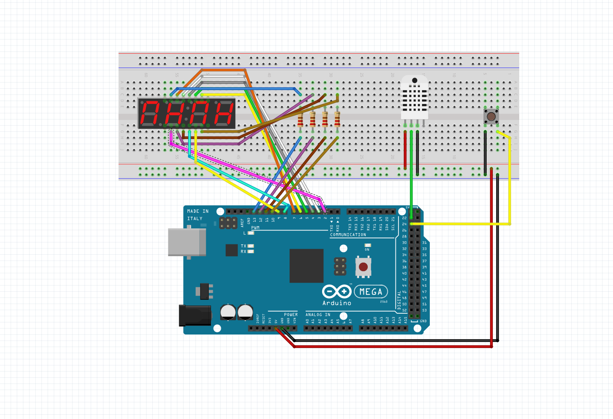

# meteostation-arduino
This is my project with Arduino based on this work https://projecthub.arduino.cc/sgongo/simple-temperature-and-humidity-sensor-dd1b3a

# Arduino Weather Station :sunny:

A compact DIY weather station built with an Arduino, a DHT11 temperature/humidity sensor, and a 4-digit 7-segment display.

The project displays real-time environmental data and allows switching between temperature and humidity modes using a push button.

---

  
  

## Features

- Real-time temperature monitoring
- Real-time humidity monitoring
- 4-digit 7-segment display output
- Push-button display mode switching
- Non-blocking DHT sensor reading
- Beginner-friendly Arduino project
- Lightweight and simple hardware setup

---

## Hardware Used

| Component | Description |
|---|---|
| Arduino Mega 2560 | Main microcontroller |
| DHT11 | Temperature and humidity sensor |
| 4-Digit 7-Segment Display | Numeric display |
| Push Button | Display mode switch |
| Breadboard | Optional |
| Jumper Wires | Connections |

---

## Libraries

The project uses the following Arduino libraries:

- `SevSeg`
- `dht_nonblocking`

Install them through the Arduino Library Manager before uploading the sketch.

---

## How It Works

The DHT11 sensor measures:
- Air temperature
- Relative humidity

The Arduino reads the sensor approximately every 4 seconds using a non-blocking method.

The current value is displayed on a 4-digit 7-segment display.

A push button allows switching between:
- Temperature display mode
- Humidity display mode

---

## Wiring

### DHT11 Sensor

| DHT11 Pin | Arduino Pin |
|---|---|
| DATA | 22 |
| VCC | 5V |
| GND | GND |

---

### Push Button

| Button Pin | Arduino Pin |
|---|---|
| Signal | 24 |
| Other Side | GND |

`INPUT_PULLUP` mode is used in the code.

---

### 4-Digit 7-Segment Display

#### Digit Pins

| Display Digit | Arduino Pin |
|---|---|
| D1 | 10 |
| D2 | 11 |
| D3 | 12 |
| D4 | 13 |

---

#### Segment Pins

| Segment | Arduino Pin |
|---|---|
| A | 9 |
| B | 2 |
| C | 3 |
| D | 5 |
| E | 6 |
| F | 8 |
| G | 7 |
| Decimal Point | 4 |

---

## Display Modes

| Mode | Description |
|---|---|
| 0 | Temperature |
| 1 | Humidity |

Press the button to switch between modes.

---

## Installation
1. Clone the repository
git clone https://github.com/yourusername/weather-station.git
2. Open the project

Open the .ino file in the Arduino IDE.

3. Install libraries

Install:

- SevSeg
- dht_nonblocking

using: `Arduino IDE → Sketch → Include Library → Manage Libraries`

4. Upload the sketch

Select:
- Correct Arduino board
- Correct COM port

Then upload the code.

| Mode | Example |
|---|---|
| Temperature | 24.5 |
| Humidity | 45 |

## Possible Improvements

- Rain/moisture sensor
- Active buzzer alerts
- OLED/LCD display support
- Wi-Fi integration
- Data logging
- RTC clock support
- Better button debouncing
- Automatic display cycling

## Known Limitations

- DHT11 has limited precision
- Display refresh depends on the main loop timing
- No persistent memory storage
- No enclosure/case included

## License

This project is licensed under the MIT License.

Feel free to use, modify, and improve it.

## Author

Created as a personal Arduino learning project.
